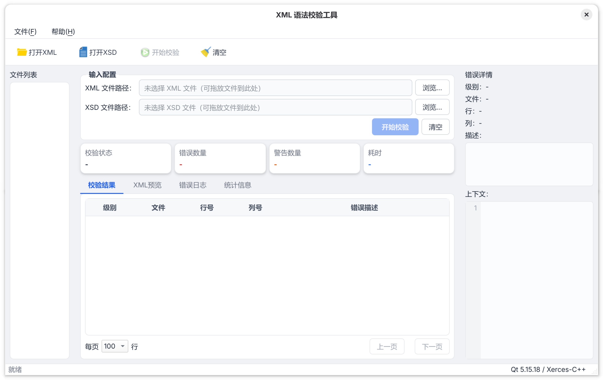

# SimpleXmlValidator

[](https://github.com/Boranstars/SimpleXmlValidator/actions/workflows/ci.yml)
[](https://github.com/Boranstars/SimpleXmlValidator/releases)
[](LICENSE)

[中文](README.md) | English

A desktop XML validation tool for developers, testers, and configuration maintainers. Select a local XML file and an XSD file, and the tool checks well-formedness and performs XSD Schema validation, displaying locatable XML errors with severity, file, line, column, and description.



## Features

- Validate a single local XML file for well-formedness and XSD Schema constraints.
- Distinguishes between "validation failed" and "unable to complete validation": the former shows XML error details, the latter shows an actionable blocking message.
- Supports paths with non-ASCII characters and spaces, and resolves local `include` / `import` dependencies in XSD files.
- Provides XML preview, syntax highlighting, error details, and context display around the offending line.
- Deduplicates repeated errors with occurrence counts and uses pagination to prevent unbounded rendering of large error sets.
- Writes system and XML validation logs; log unavailability does not affect validation results.

## Scope

The current version focuses on validating a **single local XML file against a single local XSD file**. Network files, batch validation, multiple Schema mappings, manual namespace / `schemaLocation` configuration, business-logic validation, and report export are not supported.

## Installation

### Download a Release

Download the package for your platform from the [Releases](https://github.com/Boranstars/SimpleXmlValidator/releases) page. The latest tag is [`v0.1.0`](https://github.com/Boranstars/SimpleXmlValidator/releases/tag/v0.1.0) (2026-07-23). Each release includes:

| Platform | File | How to run |
| --- | --- | --- |
| Windows x64 | `SimpleXmlValidator-windows.zip` | Extract and run `SimpleXmlValidator.exe`. Keep the DLLs and `plugins` folder alongside the executable. |
| Linux x86_64 | `SimpleXmlValidator-linux.AppImage` | Make it executable and run: `chmod +x SimpleXmlValidator-linux.AppImage && ./SimpleXmlValidator-linux.AppImage` |
| macOS | `SimpleXmlValidator-macos.dmg` | Open the DMG and drag the app to Applications. |

Each release also includes `SHA256SUMS.txt`; verifying the hash after download is recommended. On macOS or Windows, if the system warns about an unknown developer, verify the download source and SHA-256 before allowing the app to run.

### Basic Usage

1. Launch the app and click **Open XML** to select the XML file to validate.
2. Click **Open XSD** to select the corresponding XSD file.
3. Click **Start Validation**. The button is only enabled when both files are selected.
4. Review the result:
   - **Validation passed**: shows a passing status; no error table is displayed.
   - **Validation failed**: browse the error list in the "Validation Result" tab; select a row to view the full description and XML context.
   - **Unable to validate**: shown when a file is unreadable, the XSD is invalid, or a dependency cannot be loaded — a blocking message explains the cause.

Logs are written to `logs/` in the working directory by default.

## Building from Source

### Prerequisites

- CMake **3.30** or later.
- A C++17 compiler: Visual Studio 2022 on Windows, GCC or Clang on Linux, Xcode Command Line Tools on macOS.
- [vcpkg](https://github.com/microsoft/vcpkg) for installing `xerces-c`, `spdlog`, and `gtest`.
- Qt **5.15.x** (CI uses Qt 5.15.2) with the `Core`, `Gui`, and `Widgets` modules.
- Linux graphics dependencies: install `libgl1-mesa-dev` on Ubuntu/Debian; `xvfb` is also needed to run GUI tests.

The project uses vcpkg manifest mode — required libraries are installed automatically during CMake configuration. After cloning, set the following environment variables:

```bash
export VCPKG_ROOT=/path/to/vcpkg
export QT_ROOT=/path/to/Qt/5.15.2/<kit>
```

`<kit>` is typically `gcc_64` on Linux, `msvc2019_64` (or a compatible kit) on Windows, and the Homebrew Qt 5 prefix on macOS (e.g. `$(brew --prefix qt@5)`).

### Linux x86_64

```bash
git clone https://github.com/Boranstars/SimpleXmlValidator.git
cd SimpleXmlValidator

export VCPKG_ROOT=/path/to/vcpkg
export QT_ROOT=/path/to/Qt/5.15.2/gcc_64

cmake --preset linux-vcpkg -DCMAKE_BUILD_TYPE=Release
cmake --build --preset linux-vcpkg-release
xvfb-run --auto-servernum ctest --preset linux-vcpkg-release
./out/build/linux-vcpkg/SimpleXmlValidator
```

### Windows x64 (PowerShell)

```powershell
git clone https://github.com/Boranstars/SimpleXmlValidator.git
Set-Location SimpleXmlValidator

$env:VCPKG_ROOT = 'C:\path\to\vcpkg'
$env:QT_ROOT = 'C:\Qt\5.15.2\msvc2019_64'

cmake --preset windows-vcpkg -DCMAKE_BUILD_TYPE=Release
cmake --build --preset windows-vcpkg-release
ctest --preset windows-vcpkg-release
.\out\build\windows-vcpkg\Release\SimpleXmlValidator.exe
```

### macOS

```bash
git clone https://github.com/Boranstars/SimpleXmlValidator.git
cd SimpleXmlValidator

brew install qt@5
export VCPKG_ROOT=/path/to/vcpkg
export QT_ROOT="$(brew --prefix qt@5)"

cmake --preset macos-vcpkg -DCMAKE_BUILD_TYPE=Release
cmake --build --preset macos-vcpkg-release
ctest --preset macos-vcpkg-release
open ./out/build/macos-vcpkg/SimpleXmlValidator.app
```

Optional sanitizer checks: append `-DSIMPLE_XML_VALIDATOR_ENABLE_ASAN=ON` and/or `-DSIMPLE_XML_VALIDATOR_ENABLE_UBSAN=ON` to the CMake configure command when using GCC or Clang.

## Contributing

Contributions via Issues and Pull Requests are welcome. Before submitting, read [`AGENTS.md`](AGENTS.md), [`docs/概要设计报告.md`](docs/概要设计报告.md), and [`docs/项目编码规范.md`](docs/项目编码规范.md) — the design report is the authoritative source for implementation semantics. Run the affected tests before opening a PR; with dependencies available, run `ctest --preset <platform>-vcpkg-release` for the target platform. Use Conventional Commits for commit messages, e.g. `feat(validation): add new error display`.

CI builds and tests on Linux, Windows, and macOS. Pushing a tag matching `vX.Y.Z` triggers cross-platform packaging and a GitHub Release.

## Tech Stack

- C++17, CMake, Qt 5.15.x (Core / Gui / Widgets)
- Xerces-C++ (XML parsing and XSD validation)
- spdlog (logging)
- GoogleTest (automated tests)
- GitHub Actions (cross-platform CI/CD)

## License

This project is licensed under the [MIT License](LICENSE).
