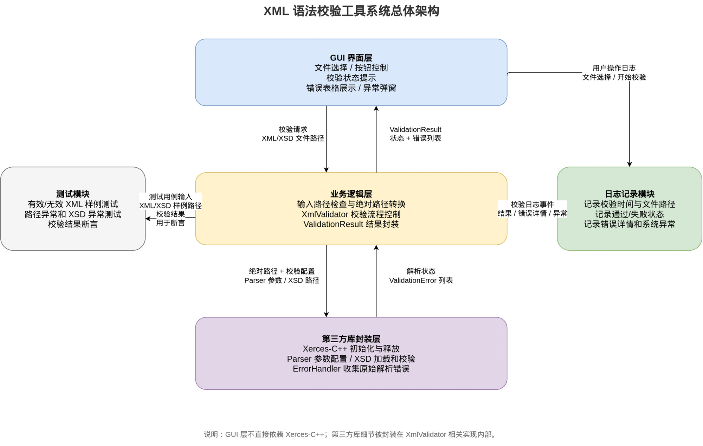
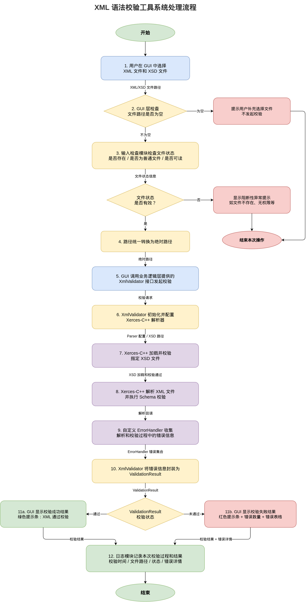
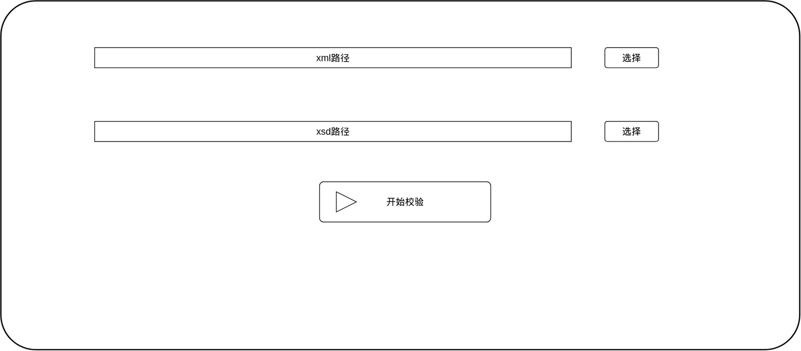
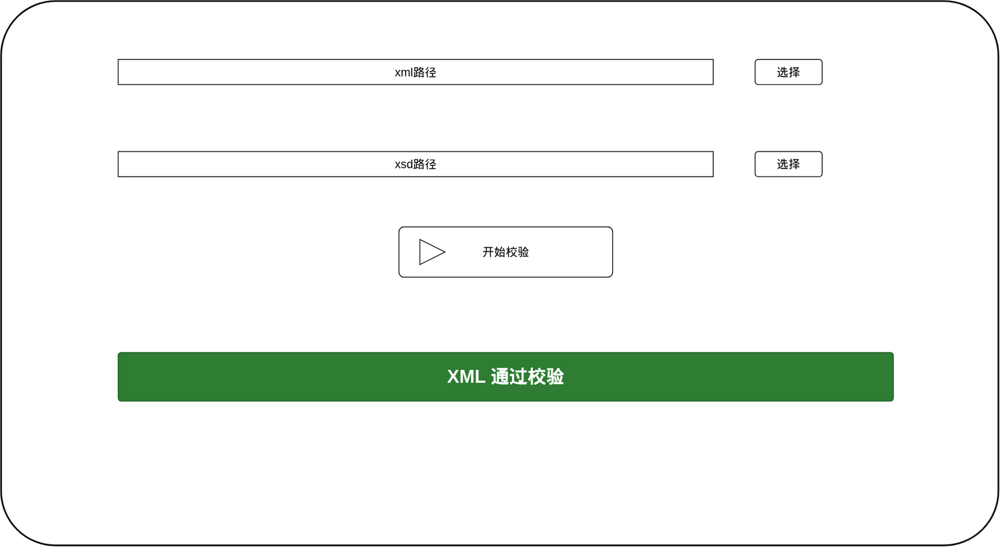
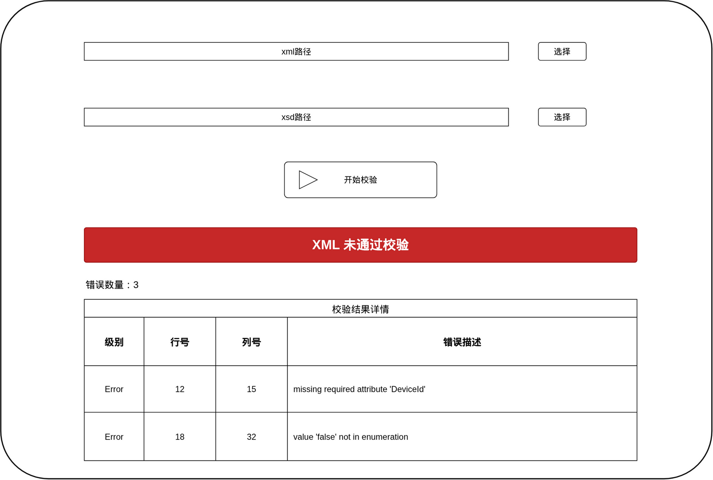

# XML 语法校验工具概要设计说明书
---
## 1. 引言
### 1.1 项目背景
XML（可扩展标记语言）因其结构清晰、可读性强、平台无关等特点，被广泛应用于配置文件、数据交换、业务报文以及各类报告文件中。在实际开发和测试过程中，XML 文件通常还需要配合 XSD（XML Schema Definition）进行结构约束，以保证数据格式、字段类型、元素顺序和必填项等内容符合预期。

在实际使用中，XML 文件一旦存在标签未闭合、元素嵌套错误、属性类型不符合约束、必填元素缺失等问题，就可能导致程序解析失败、配置加载异常或业务数据处理错误。若完全依赖人工检查，不仅效率低，而且容易遗漏问题，尤其是在 XML 文件内容较多、结构较复杂时，人工排查的成本更高。

因此，有必要设计并实现一个 XML 语法校验工具，对 XML 文件进行自动化校验，并能够结合 XSD 约束给出明确的错误定位信息，从而提升 XML 文件检查的效率和准确性。

### 1.2 项目目标
本工具的目标是实现一个基于 C++ 和 Qt 的 XML 语法校验工具，支持用户选择 XML 文件和对应的 XSD 文件，对 XML 文件进行格式良好性检查和 XML Schema 校验，并在界面中输出清晰的校验结果。

工具应能够完成以下任务：

- 接收用户选择的 XML 文件和 XSD 文件；
- 检查 XML 文件是否满足基本格式良好性要求；
- 根据 XSD 文件对 XML 内容进行结构约束校验；
- 显示校验通过或未通过的结果；
- 在校验失败时展示错误级别、行号、列号和错误描述；
- 记录校验过程和运行状态，便于后续排查问题。

通过该工具，用户可以快速定位 XML 文件中的语法错误和结构错误，减少手工检查工作量，提高 XML 文件校验的效率和可靠性。

### 1.3 适用范围
本工具主要面向开发人员、测试人员以及需要处理 XML 配置文件或 XML 报文的配置维护人员，用于在本地对 XML 文件进行语法和结构校验。

适用场景包括但不限于：

- 开发阶段对 XML 配置文件进行格式检查；
- 测试阶段验证 XML 样例文件是否符合 XSD 约束；
- 维护阶段检查业务系统生成的 XML 文件是否有效；
- 在交付或部署前对 XML 文件进行快速预检，减少因 XML 格式错误导致的运行问题。

本工具适用于单个 XML 文件与单个 XSD 文件的本地校验场景，不面向网络传输、数据库存储或复杂业务语义校验场景。

### 1.4 术语和缩略语
| 术语/缩略语 | 说明 |
|---|---|
| XML | Extensible Markup Language，可扩展标记语言，用于描述结构化数据。 |
| XSD | XML Schema Definition，用于定义 XML 文档的结构、元素、属性和数据类型约束。 |
| XML Schema | XML 结构约束规范，本项目中主要指通过 XSD 文件描述的 XML 校验规则。 |
| GUI | Graphical User Interface，图形用户界面。 |
| Qt | 跨平台 C++ 应用程序开发框架，本项目用于实现图形界面。 |
| Xerces-C++ | Apache 提供的 C++ XML 解析库，本项目用于完成 XML 解析和 XSD Schema 校验。 |
| spdlog | C++ 日志库，本项目用于记录程序运行状态和关键异常信息。 |
| GTest | Google Test，C++ 测试框架，用于编写和执行单元测试。 |

### 1.5 开发和运行环境
本项目采用 C++17 进行开发，使用 Qt 实现图形用户界面，使用 Xerces-C++ 完成 XML/XSD 校验。开发和运行环境如下：

| 类别 | 内容 |
|---|---|
| 目标操作系统 | Windows 10/11、Linux x86_64 |
| 开发语言 | C++17 |
| GUI 框架 | Qt 5.12.x |
| XML 校验库 | Xerces-C++ |
| 构建工具 | CMake |
| 日志库 | spdlog |
| 测试框架 | GTest |
| 开发工具 | CLion、Visual Studio 2022 |

其中，Qt 负责界面显示和用户交互，Xerces-C++ 负责 XML 格式良好性检查和 XSD Schema 校验，spdlog 用于记录程序运行日志，GTest 用于核心校验逻辑的单元测试。

## 2. 需求概述
### 2.1 功能需求
- 选择 XML 文件
- 选择 XSD 文件
- 执行校验
- 显示通过/失败状态
- 显示错误级别、行号、列号、错误描述
- 记录日志

## 3. 总体设计
### 3.1 设计目标
本系统旨在提供一个操作简洁、功能明确的 XML 校验工具，帮助用户快速发现 XML 文件中的格式和 Schema 问题。设计目标包括：
- **易用性**：提供直观的 GUI 界面，用户可以轻松选择文件并执行校验。
- **准确性**：确保校验结果准确，包括格式良好性检查和 XSD Schema 校验。
- **可扩展性**：设计模块化，便于后续功能扩展，如日志导出、批量校验等。
- **跨平台**：支持 Windows 和 Linux 平台，确保广泛的适用性。
- **性能** ：在初期版本中，优先保证功能完整性和正确性，后续可优化性能以支持大文件校验。
- **异常处理**：提供详细的错误提示，帮助用户快速定位问题，同时保证程序在异常情况下稳定运行。
- **封装第三方库**：对 XML 解析库进行封装，避免 GUI 层直接依赖复杂的原始 API，提高代码可维护性。

### 3.2 系统总体架构

在总体架构中，XmlValidator 是业务逻辑层的核心校验类，负责接收 XML 文件路径和 XSD 文件路径，组织输入检查、解析器配置、XML/XSD 校验和结果封装等流程。

ErrorHandler 是第三方库封装层中的错误收集组件，负责接收 Xerces-C++ 在解析和校验过程中产生的 warning、error、fatal error，并将其转换为项目内部可使用的错误信息。

第三方库封装层负责 Xerces-C++ 的初始化与释放、Parser 参数配置、XSD 加载和校验，以及解析错误的收集与转换。

ValidationResult 是校验模块对 GUI 层返回的统一结果对象，用于表示一次校验的最终状态、错误列表和补充提示信息。GUI 层根据 ValidationResult 决定显示“校验通过”或“校验失败”。

### 3.3 系统处理流程

1. 用户在 GUI 中选择 XML 文件和 XSD 文件。
2. GUI 层检查文件路径是否为空。
3. 输入检查模块检查文件状态（是否存在、是否为普通文件、是否可读）。
4. 路径统一转换为绝对且词法规范化的路径。
5. GUI 调用业务逻辑层提供的 XmlValidator 接口发起校验。
6. XmlValidator 初始化并配置 Xerces-C++ 解析器。
7. XmlValidator 调用 Xerces-C++ 加载并校验指定 XSD 文件。
8. XSD 加载和校验通过后，Xerces-C++ 对 XML 文件进行解析并执行 Schema 校验。
9. 自定义 ErrorHandler 收集解析和校验过程中产生的错误信息。
10. XmlValidator 将 ErrorHandler 收集到的错误信息封装为 ValidationResult。
11. GUI 根据 ValidationResult 显示校验成功或失败结果。
12. 日志模块记录本次校验过程和结果。

### 3.4 设计原则
本系统在设计时遵循以下原则：

1. 分层设计原则
系统将 GUI 界面、业务逻辑、第三方库封装、日志记录和测试模块进行分离。GUI 层只负责用户交互和结果展示，不直接调用 Xerces-C++ API；XML 校验相关逻辑集中在业务逻辑层和第三方库封装层中实现。方便并行开发和后续测试维护。

2. 单一职责原则
各模块只负责自身职责范围内的功能。GUI 模块负责文件选择和结果展示，XmlValidator 负责组织校验流程，ErrorHandler 负责收集解析错误，日志模块负责记录校验过程和运行信息。

3. 统一结果返回原则
校验模块对外统一返回 ValidationResult。GUI 层不直接处理 Xerces-C++ 的原始异常或错误对象，而是根据 ValidationResult 中的校验状态和错误列表展示结果。

4. 校验失败与程序异常分离原则
XML 文件不符合 XSD 约束属于正常校验失败，应在主界面结果区域展示；文件不存在、文件无权限、XSD 加载失败、解析器初始化失败等属于阻断性异常，应通过异常提示或弹窗处理。

5. 可扩展性原则
第一版系统优先实现单个 XML 文件与单个 XSD 文件的校验功能。模块划分时保留后续扩展空间，例如批量校验、日志导出、多线程校验、错误定位跳转等功能。
## 4. 模块设计

| 模块名称 | 主要职责 | 输入 | 输出 | 依赖 |
|---|---|---|---|---|
| GUI 界面模块 | 文件选择、按钮控制、结果展示、异常提示 | 用户操作、XML/XSD 文件路径 | 校验请求、界面提示 | Qt、XmlValidator |
| 输入检查模块 | 检查路径为空、文件存在性、文件类型、读取权限，并转换为绝对且词法规范化的路径 | XML/XSD 文件路径 | 检查结果、规范化绝对路径 | std::filesystem |
| XML 校验模块 | 组织校验流程，加载并检查 XSD Schema，配置解析器，调用 Xerces-C++ 完成校验 | XML/XSD 绝对路径 | ValidationResult | Xerces-C++、ErrorHandler |
| 错误收集模块 | 收集解析和校验过程中的 warning、error、fatal error | Xerces-C++ 错误回调 | ValidationError 列表 | Xerces-C++ ErrorHandler API |
| 结果模型与数据结构模块 | 定义 ValidationError、ValidationResult 等统一数据结构，作为模块间数据交换约定 | 校验状态、错误信息 | 标准化结果对象 | C++ 标准库 |
| 日志记录模块 | 记录程序运行状态、关键操作和异常信息；可记录校验摘要，完整校验结果优先由 ValidationResult 提供给界面展示 | 文件路径、校验状态、异常信息 | 系统运行日志、XML 校验日志 | spdlog |
| 测试模块 | 验证合法/非法 XML、异常路径、XSD 异常等场景 | 测试 XML/XSD 样例 | 测试结果 | GTest、XmlValidator |

### 4.1 GUI 界面模块
负责文件选择、按钮状态控制、校验结果展示、错误表格展示、阻断异常弹窗。
主要职责包括：

- 提供 XML 文件和 XSD 文件选择入口。
- 在用户未选择完整文件时禁用或阻止校验操作。
- 调用业务逻辑层提供的 XmlValidator 接口发起校验。
- 根据 ValidationResult 显示校验成功或失败状态。
- 在校验失败时显示错误数量和错误明细表格。
- 对文件缺失、无权限等阻断性异常进行弹窗提示。
### 4.2 文件输入检查模块
输入检查模块负责在正式调用 XML 解析器之前，对用户输入的文件路径进行基础检查，避免无效输入直接传入校验模块。

输入检查模块只负责文件路径和文件可访问性检查，不负责判断 XSD 文件内容是否合法。XSD 文件自身语法和 Schema 有效性由 XML 校验模块在加载 Schema 时处理。

主要职责包括：

- 检查 XML 文件路径和 XSD 文件路径是否为空。
- 检查文件是否存在。
- 检查路径是否指向普通文件。
- 检查文件是否具有读取权限。
- 将相对路径转换为绝对且词法规范化的路径，消除 `.`、`..` 和冗余分隔符造成的路径歧义；不解析符号链接。
### 4.3 XML 校验模块
XML 校验模块是系统的核心业务模块，由 XmlValidator 类承担主要职责。该模块负责组织 XML/XSD 校验流程，并向 GUI 层返回统一的 ValidationResult。

主要职责包括：

- 接收 XML 文件路径和 XSD 文件路径。
- 初始化并配置 Xerces-C++ 解析器。
- 启用 XML Schema 校验相关配置。
- 第一版仅支持单个 XML 文件与单个 XSD 文件的直接校验，不提供多命名空间、多 Schema 映射或用户自定义 SchemaLocation 配置。
- 在校验 XML 前加载并校验 XSD Schema 文件，确保 Schema 可用于后续 XML 校验。
- 若 XSD 文件无效、依赖缺失或加载失败，则返回 `ValidationStatus::Failed`。
- 调用 Xerces-C++ 对 XML 文件进行格式良好性检查和 XSD Schema 校验。
- 获取 ErrorHandler 收集到的错误信息。
- 将校验状态和错误列表封装为 ValidationResult。

### 4.4 错误收集模块
错误收集模块负责接收 Xerces-C++ 在解析和校验过程中产生的错误回调，并将其转换为项目内部统一的错误信息结构。

主要职责包括：

- 实现自定义 ErrorHandler。
- 捕获 warning、error、fatal error。
- 获取错误所在行号、列号和错误描述。
- 将 Xerces-C++ 原始错误信息转换为 ValidationError。
- 向 XmlValidator 提供错误列表。

### 4.5 结果模型与数据结构模块

结果模型与数据结构模块用于定义系统内部统一使用的数据结构，作为 GUI 界面模块、XML 校验模块、错误收集模块和日志模块之间的数据交换约定。

该模块不直接执行 XML 解析或界面显示逻辑，而是用于描述一次校验的结果状态、错误信息和补充说明，避免各模块直接依赖 Xerces-C++ 的原始错误对象或 Qt 界面对象。

主要职责包括：

- 定义校验状态类型，如校验通过、校验未通过、校验过程失败等。
- 定义错误级别类型，如 Warning、Error、Fatal。
- 定义单条校验错误的数据结构，包括错误级别、行号、列号和错误描述。
- 定义一次完整校验结果的数据结构，包括校验状态、错误列表和补充提示信息。
- 为 GUI 展示、日志记录和测试断言提供统一的数据来源。

### 4.6 日志模块

日志模块用于记录 XML 校验记录和系统运行状态。日志分为 XML 校验记录和系统运行日志两类：XML 校验记录面向工具使用者和测试人员，用于查看历史校验结果；系统运行日志面向开发者和维护人员，用于定位程序运行问题。

主要记录内容包括：

- 程序启动和退出。
- 用户选择 XML 文件和 XSD 文件的关键操作。
- 开始校验和校验结束状态。
- Xerces-C++ 初始化和释放状态。
- XSD 加载失败、解析器异常等阻断性异常。
- 日志写入失败等运行时问题。


日志模块可以根据需要记录校验摘要，例如校验时间、文件路径、校验状态和错误数量，但完整错误明细仍以 `ValidationResult` 作为主要数据来源。第一版不提供校验报告导出功能。

#### 4.6.1 XML 校验日志

XML 校验记录用于记录每次 XML 校验的输入、结果和错误详情，主要面向工具使用者和测试人员，可用于查看历史校验结果。

主要记录内容包括：

- 校验时间。
- XML 文件路径。
- XSD 文件路径。
- 校验状态，如通过、未通过、校验失败。
- 错误数量。
- 错误级别、行号、列号和错误描述。

#### 4.6.2 系统运行日志

系统运行日志用于记录程序自身运行状态和内部异常，主要面向开发者和维护人员，用于问题排查。

主要记录内容包括：

- 程序启动和退出。
- Xerces-C++ 初始化和释放状态。
- 文件读取异常。
- XSD 加载失败。
- 未捕获异常或内部错误。
- 日志写入失败等运行时问题。

XML 校验日志和系统运行日志在内容上相互独立。XML 校验日志用于展示或导出校验结果，系统运行日志用于开发和维护阶段定位程序问题。日志模块应保证系统运行日志写入失败不会影响 XML 校验主流程。XML 校验日志和系统运行日志逻辑上分离，物理上不要求必须写入同一日志文件，可根据实际情况选择不同日志文件或不同日志目录。

### 4.7 测试模块
测试模块用于验证 XML 校验工具的核心功能是否符合预期，主要面向业务逻辑层和 XML 校验模块，不直接依赖 GUI。
其主要通过CTest结合py/sh脚本对程序输入输出进行自动化测试，可结合GTest对XmlValidator类进行单元测试。

主要职责包括：

- 测试合法 XML 文件是否能够通过校验。
- 测试缺失元素、属性错误、枚举错误等非法 XML 是否能够被识别。
- 测试文件不存在、路径错误、XSD 无效等异常输入。
- 验证 ValidationResult 中的状态和错误列表是否符合预期。

## 5. 核心接口和数据结构设计
核心接口和数据结构用于描述 GUI 与 XML 校验模块之间的调用关系，以及 XML 校验过程中产生的状态、错误信息和结果对象，是 GUI 界面模块、XML 校验模块、日志模块和测试模块之间的数据交换基础。设计时应避免在 GUI 层直接使用 Xerces-C++ 的原始异常类型或 Qt 控件对象，而是通过项目内部统一的接口和数据结构传递结果。

### 5.1 核心接口设计

GUI 层通过 `XmlValidator` 暴露的统一接口发起校验。该接口对外只接受 XML 文件路径和 XSD 文件路径，并返回一次校验的完整结果。

```cpp
class XmlValidator {
public:
    ValidationResult validate(
        const std::filesystem::path& xmlPath,
        const std::filesystem::path& xsdPath);
};
```

接口说明如下：

| 项目 | 说明 |
|---|---|
| 输入参数 | `xmlPath` 为待校验 XML 文件路径，`xsdPath` 为对应 XSD 文件路径 |
| 参数类型 | 使用 `std::filesystem::path` 表达路径语义，避免在 GUI 层直接拼接字符串 |
| 返回值 | 返回 `ValidationResult`，用于表示本次校验的最终状态、错误列表和补充信息 |
| 成功情况 | XML 通过格式良好性检查和 XSD 校验时，返回 `ValidationStatus::Valid` |
| 普通失败 | XML 不符合已加载的 XSD 约束时，返回 `ValidationStatus::Invalid` 并附带错误列表 |
| 阻断异常 | XSD 加载失败、依赖缺失、解析器初始化失败等导致流程无法继续时，返回 `ValidationStatus::Failed` 并附带提示信息 |

该接口的实现细节由 XML 校验模块和第三方库封装层完成，GUI 层只负责调用接口并展示 `ValidationResult`。

### 5.2 校验状态类型

校验状态用于描述一次校验操作的最终结果。系统需要区分“XML 校验通过”“XML 校验未通过”和“校验流程无法完成”三种情况。

```cpp
enum class ValidationStatus {
    Valid,      // XML 文件通过格式良好性检查和 XSD Schema 校验
    Invalid,    // XML 文件未通过校验，但校验流程正常完成
    Failed      // 前置检查、XSD 加载、解析器或程序异常导致校验流程无法完成
};
```

其中，`Invalid` 表示 XML 文件本身不符合 XSD 约束，属于正常校验结果；`Failed` 表示工具无法完成校验，例如前置文件检查失败、XSD 文件自身无效、XSD 依赖缺失、Schema 加载失败、解析器初始化失败或程序内部异常等。

XSD 错误与 XML 校验错误需要区分处理。XSD 文件自身无效时，工具无法继续判断 XML 是否符合该 Schema，因此属于校验流程失败；XML 文件不符合已经成功加载的 XSD 时，才属于正常的校验未通过。

### 5.3 错误级别类型

错误级别用于描述解析器返回的错误严重程度。该类型主要对应 Xerces-C++ `ErrorHandler` 中的 `warning`、`error` 和 `fatalError` 回调。

```cpp
enum class ErrorSeverity {
    Warning,
    Error,
    Fatal
};
```

GUI 界面可根据错误级别在错误表格中显示不同文本；日志模块也可根据该字段记录不同级别的校验信息。

### 5.4 单条校验错误结构

`ValidationError` 用于表示一条具体的 XML 校验错误。该结构只描述 XML 解析和 XML/XSD 校验过程中定位到 XML 文档内容的错误，例如 XML 标签未闭合、元素顺序不符合 XSD、必填元素缺失、属性值类型错误等。

文件路径为空、文件不存在、文件无读取权限等输入问题应由前置输入检查模块处理；XSD 文件自身无效、XSD 依赖缺失、Schema 加载失败、解析器初始化失败等导致校验流程无法继续的问题，不应作为 `ValidationError` 放入错误列表，而应通过 `ValidationStatus::Failed` 和 `message` 表示，并记录到系统运行日志中。

```cpp
struct ValidationError {
    ErrorSeverity severity;
    std::size_t line;
    std::size_t column;
    std::string message;
};
```

字段说明如下：

| 字段 | 类型 | 说明 |
|---|---|---|
| `severity` | `ErrorSeverity` | 错误级别，包括 Warning、Error、Fatal |
| `line` | `std::size_t` | 错误所在 XML 行号 |
| `column` | `std::size_t` | 错误所在 XML 列号 |
| `message` | `std::string` | 错误描述信息，由解析器错误信息转换得到 |

由于 `ValidationError` 的职责限定为 XML 内容级校验错误，因此行号和列号作为必填字段处理。自定义 `ErrorHandler` 从 Xerces-C++ 的 `SAXParseException` 中获取行号、列号和错误描述，并转换为该结构。对于无法定位到 XML 文档具体行列的错误，不应构造 `ValidationError`，而应作为校验流程失败或系统异常处理。

### 5.5 校验结果结构

`ValidationResult` 用于表示一次完整校验操作的输出结果，是 XML 校验模块对外返回的核心数据结构。

```cpp
struct ValidationResult {
    ValidationStatus status;
    std::vector<ValidationError> errors;
    std::string message;
};
```

字段说明如下：

| 字段 | 类型 | 说明 |
|---|---|---|
| `status` | `ValidationStatus` | 本次校验的最终状态 |
| `errors` | `std::vector<ValidationError>` | 校验过程中收集到的错误列表 |
| `message` | `std::string` | 补充说明信息，可用于提示校验成功、校验失败或流程异常原因 |

`ValidationResult` 的典型使用规则如下：

- 当 `status == ValidationStatus::Valid` 时，表示校验通过，`errors` 通常为空，GUI 显示绿色成功提示。
- 当 `status == ValidationStatus::Invalid` 时，表示校验流程正常完成但 XML 未通过校验，`errors` 中保存具体错误，GUI 显示红色失败提示和错误表格。
- 当 `status == ValidationStatus::Failed` 时，表示校验流程无法完成，例如 XSD 文件无效、Schema 加载失败或解析器初始化失败等，`errors` 通常为空，`message` 中保存失败原因，GUI 可通过弹窗或错误提示告知用户。

### 5.6 数据结构关系

核心数据结构之间的关系如下：

```text
ValidationResult
├── status: ValidationStatus
├── errors: std::vector<ValidationError>
│   └── ValidationError
│       ├── severity: ErrorSeverity
│       ├── line
│       ├── column
│       └── message
└── message
```

在校验流程中，自定义 `ErrorHandler` 负责收集 Xerces-C++ 产生的原始错误信息，并转换为 `ValidationError`；`XmlValidator` 根据错误列表和校验执行状态生成 `ValidationResult`；GUI 界面模块和日志模块只依赖 `ValidationResult`，不直接依赖 Xerces-C++ 的原始错误对象。

需要注意的是，`ValidationError` 与程序运行异常不是同一类信息。`ValidationError` 面向 XML 内容校验结果，适合在主界面错误表格和 XML 校验日志中展示；程序运行异常面向工具自身运行状态，适合通过 `ValidationStatus::Failed`、提示信息和系统运行日志处理。

### 5.7 设计说明

本系统采用独立的数据结构描述校验结果，主要原因如下：

- 降低模块耦合：GUI 层、日志模块和测试模块不需要了解 Xerces-C++ 的具体 API。
- 便于界面展示：GUI 可直接根据 `ValidationResult` 判断显示成功状态、失败状态或异常提示。
- 便于日志记录：日志模块可直接遍历 `errors` 生成 XML 校验日志。
- 便于自动化测试：测试模块可根据 `status` 和 `errors` 对校验结果进行断言。
- 便于后续扩展：后续可在不改变整体流程的情况下增加错误码、文件名、错误分类、修复建议等字段。

## 6. UI设计
### 主界面草图

主界面包括 XML 文件选择区、XSD 文件选择区、开始校验按钮和结果显示区。界面采用渐进式结果展示方式：初始状态下仅显示文件选择区和操作按钮，校验完成后再根据结果动态显示对应的结果区域。

#### 初始状态



用户可以通过点击“选择 XML 文件”和“选择 XSD 文件”按钮选择文件，也可以拖动文件到指定区域。当 XML 文件和 XSD 文件均已选择后，“开始校验”按钮才可点击；否则按钮置灰，避免用户在输入不完整时发起校验。

初始状态下不显示校验结果提示条和错误表格，保持界面简洁。

#### 校验成功



当 XML 通过校验时，界面在“开始校验”按钮下方显示绿色提示条，提示“XML 通过校验”。此时不显示错误数量和错误表格。

#### 校验失败



当 XML 未通过校验时，界面在“开始校验”按钮下方显示红色提示条，提示“XML 未通过校验”。提示条下方显示错误数量和错误明细表格。

错误明细表格包括以下列：

- 级别：Warning、Error 或 Fatal。
- 行号：错误所在 XML 行号。
- 列号：错误所在 XML 列号。
- 错误描述：XML 解析器返回的错误原因。

当错误数量较多时，表格应支持滚动查看。

#### 日志导出

“导出日志”按钮可作为后续扩展功能。第一版优先保证 XML/XSD 文件选择、校验执行、结果提示和错误明细展示。若后续实现日志导出，可将当前校验时间、XML 文件路径、XSD 文件路径、校验状态和错误明细导出为文本文件。

### 弹窗说明

### 文件选择

点击“选择 XML 文件”或“选择 XSD 文件”按钮后，弹出文件选择对话框，用户可以选择对应的文件。若用户未选择文件直接关闭对话框，则不进行任何操作。

### 异常提示

弹窗用于提示无法继续校验的阻断性异常，例如：

- 未选择 XML 文件或 XSD 文件。
- 文件路径不存在。
- 选择的路径不是文件。
- 文件无读取权限。
- XSD 文件加载失败。
- 程序内部异常。

XML 内容不符合 XSD 约束属于正常校验结果，不通过弹窗提示，而是在主界面的失败状态和错误表格中展示。异常提示内容应尽量明确，帮助用户定位问题。

## 7. 异常处理设计
### 输入文件异常
这些异常应该在输入侧或者gui侧文件选择时就进行处理，避免传入解析模块。

| 异常 | 处理方式 |
|---|---|
| 未选择 XML 文件 | 提示用户选择 XML 文件 |
| 未选择 XSD 文件 | 提示用户选择 XSD 文件 |
| 文件路径不存在 | 提示“文件不存在” |
| 路径指向目录而不是文件 | 提示“请选择有效文件” |
| 文件无读取权限 | 提示“无法读取文件” |
| 文件为空 | 提示“文件内容为空或无法解析” |
| 文件扩展名不符合预期 | 警告，但不一定强制阻止 |
| 中文路径、空格路径 | 程序应正常支持，路径统一用 `std::filesystem` 处理 |
| 传入的是相对路径 | 输入检查模块统一转换为绝对且词法规范化的路径，避免解析库报错和路径歧义 |
注：若gui开发从简，则文件路径、类型、权限等提示可合并。


### 解析异常
#### xsd文件异常
这些异常在解析开始前就应该被捕获并且提示用户。

XSD 文件异常由 XML 校验模块在 Schema 加载阶段捕获。该类异常表示校验流程无法继续，不进入主界面的 XML 错误表格，而是作为阻断性异常处理，并记录到系统运行日志中。

| 异常 | 处理方式 |
|---|---|
| XSD 文件语法错误 | 提示 Schema 文件无效 |
| XSD include/import 或 schemaLocation 依赖加载失败 | 提示 Schema 依赖或路径配置错误 |
| XSD 路径为相对路径导致 include 失败 | 内部统一转换绝对路径，尽量避免 |

#### xml解析异常
这些应该由解析库抛出，程序捕获后在界面上显示错误信息，并记录到日志中。程序不应该在这些异常下崩溃，应该输出错误和对应行列号
| 异常 | 示例 |
|---|---|
| XML 格式不良好 | 标签未闭合、嵌套错误、属性未加引号 |
| 编码声明和实际编码不一致 | 声明 UTF-8，但文件不是 UTF-8 |
| 特殊字符未转义 | `&`、`<` 直接出现在文本中 |
| 根节点错误 | 期望 `CheckReport`，实际是其他节点 |
| 元素顺序错误 | XSD 要求 `System` 在 `Ied` 前 |
| 必填元素缺失 | 缺少 `CheckTime` |
| 必填属性缺失 | 缺少 `DeviceId` |
| 属性值类型错误 | 日期格式错误、数字字段填了文本 |
| 枚举值错误 | `IsDifferent="false"`，但 XSD 只允许 `0/1` |
| 出现未定义元素或属性 | XML 中有 XSD 未声明的字段 |

### 程序运行时异常
#### 框架异常
这些是程序框架自身异常，和校验无关
| 异常 | 处理方式 |
|---|---|
| Xerces 初始化失败 | 显示“XML 校验引擎初始化失败” |
| Xerces 解析过程中抛出异常 | 捕获并显示错误 |
| 内存不足 | 提示校验失败，建议检查文件大小 |
| 大文件校验耗时过长 | GUI 显示处理中，必要时支持取消 |
| 程序内部未捕获异常 | 顶层捕获，写入系统日志 |

#### ui异常
| 异常 | 处理方式 |
|---|---|
| 重复点击校验按钮 | 校验中禁用按钮 |
| 校验中关闭窗口 | 询问或安全终止后台任务 |
| 错误列表为空但状态异常 | 统一显示通用错误信息 |
| 表格显示大量错误导致卡顿 | 限制展示数量，日志保留完整信息 |

#### 日志异常
这些不应该影响程序主流程和校验流程，优先保证输出校验结果
| 异常 | 处理方式 |
|---|---|
| 日志目录不存在 | 自动创建或退化到默认目录 |
| 日志文件无写权限 | GUI 提示一次，校验仍可继续 |
| 日志写入失败 | 不应导致程序崩溃，可提示 |
| 日志文件过大 | 后续可做滚动日志 |

## 8. 设计约束和后续拓展
### 8.1 当前版本设计约束

本系统第一版优先实现单个 XML 文件与单个 XSD 文件的本地校验功能，重点保证校验结果准确、错误信息清晰、界面操作简单。

当前版本设计约束包括：

- 校验方式以本地文件校验为主，不涉及网络文件下载或远程服务调用。
- 每次校验以一个 XML 文件和一个 XSD 文件为输入。
- XML 校验依赖 Xerces-C++ 提供的格式良好性检查和 XSD Schema 校验能力。
- XML 不符合 XSD 约束时，在主界面展示错误列表；文件、XSD、解析器等导致校验流程无法继续的问题，作为阻断性异常处理。
- 第一版不提供命名空间或 SchemaLocation 的手动配置入口。工具以用户选择的 XSD 文件作为校验依据，由校验模块根据 XSD 是否包含 targetNamespace 选择合适的 Xerces-C++ 配置方式。
- 第一版优先保证功能正确性，暂不对超大 XML 文件进行专门性能优化。

### 8.2 当前版本不处理的内容

为控制实现复杂度，当前版本暂不处理以下内容：

- 批量 XML 文件校验。
- XML 文件内容编辑和错误位置跳转。
- XSD 文件图形化编辑。
- 多个 XSD 文件的复杂工程化管理。
- 用户在界面中手动配置 XML 命名空间、targetNamespace、schemaLocation 或多个命名空间到多个 XSD 文件的映射关系。
- 校验报告导出功能，第一版仅在界面中展示校验结果和错误列表。
- 网络路径、数据库或远程接口中的 XML 数据校验。
- XML 业务语义规则校验，例如跨字段一致性、业务编码合法性等。
- 复杂权限管理和用户账号系统。

上述内容不影响第一版工具完成 XML/XSD 基础校验目标，可作为后续版本扩展方向

## 9. 附录

### 9.1 业务xsd文件及说明
见附件a2_a4_xsd_output

### 9.2 xsd测试样例
见附件xsd_test
