# XML 补充文件说明

## 1 A2附录对应 XML 文件补充

1.1 补充格式良好性测试
1.1.1 标签未闭合 / 大小写不匹配 (A2_fatal_unclosed_tag.xml)
测试目的：验证首尾标签大小写敏感及闭合检查。
预期报错：(Fatal)expected end of tag 'APP'
测试结果：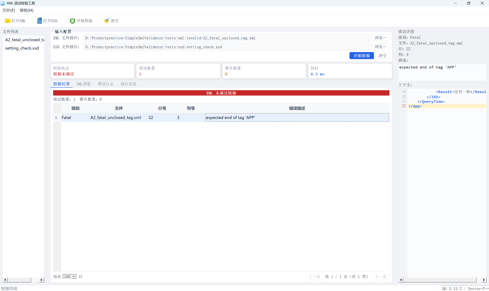
1.1.2 元素交叉嵌套 (A2_fatal_bad_nesting.xml)
测试目的：验证 XML 节点必须正确嵌套的规则。
预期报错：(Fatal)expected end of tag 'Record'
测试结果：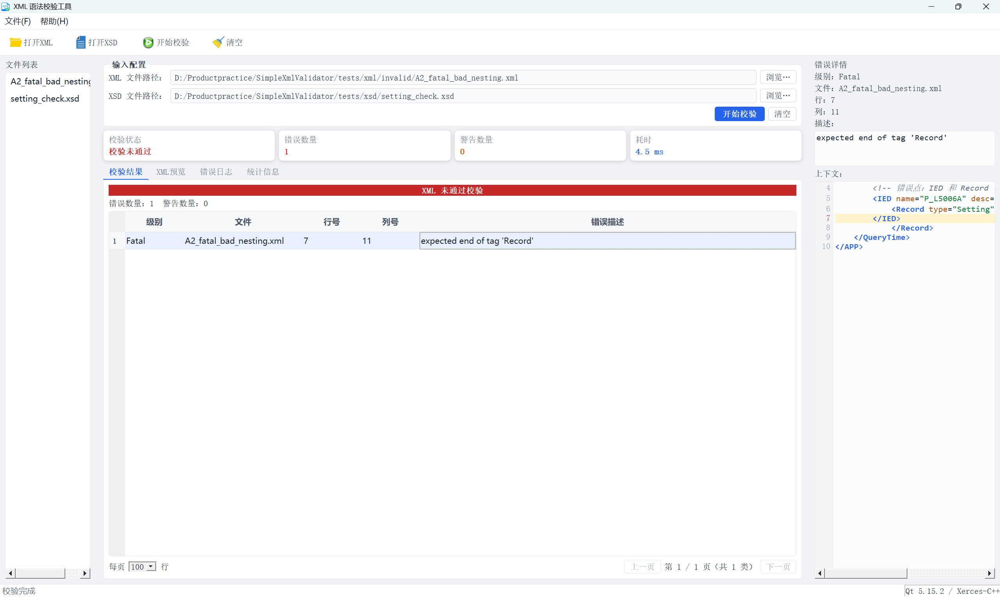
1.1.3 属性值缺少引号 (A2_fatal_no_quotes.xml)
测试目的：验证属性值必须被双引号或单引号包裹。
预期报错：(Fatal)attribute value expected
测试结果：
1.1.4 特殊字符未转义 (A2_fatal_special_char.xml)
测试目的：验证 XML 文本中直接出现 <、& 等非法字符时的报错。
预期报错：(Fatal)element name expected
测试结果：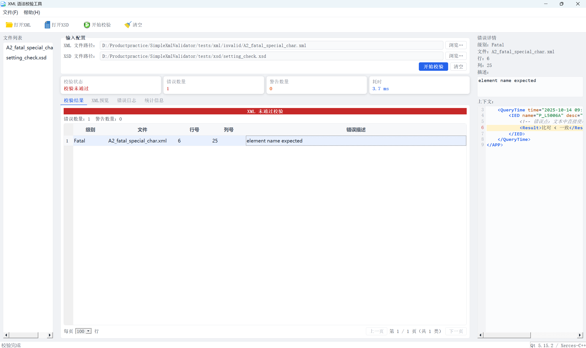

1.2 补充严密的 XSD 约束测试（Schema 逻辑错误）
1.2.1 节点个数越界 (A2_invalid_maxoccurs.xml)
测试目的：验证 maxOccurs="1" 的上限约束。
预期报错：(Error)element 'Record' is mot allowed for content model '(Record,CompareTemplate,Result)'
测试结果：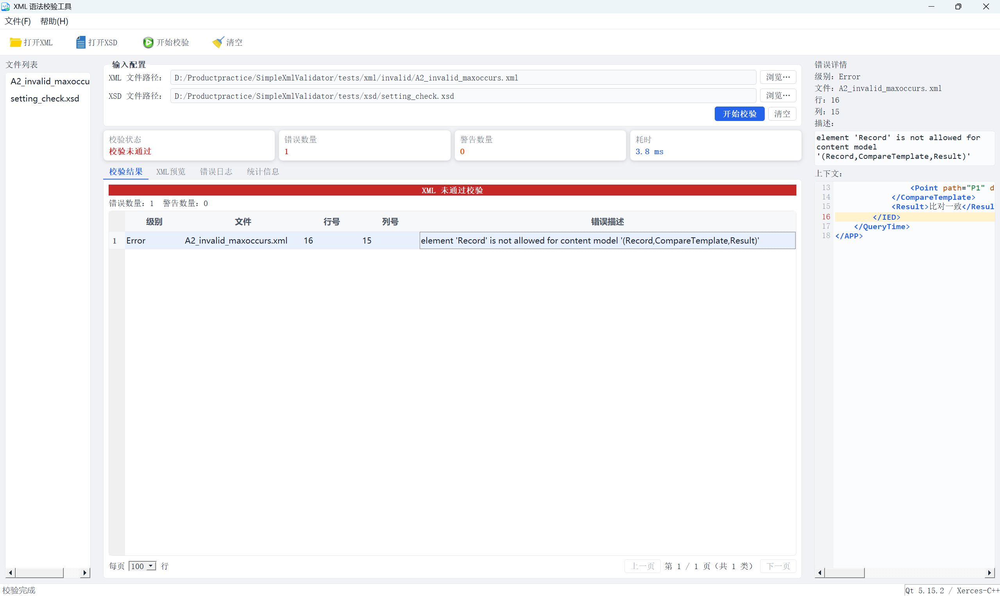
1.2.2 数据类型校验失败 (A2_invalid_float_value.xml)
测试目的：验证数值类型的严格校验（如 Float/Decimal 不能填字母）。
预期报错：(Error)invalid character encountered
测试结果：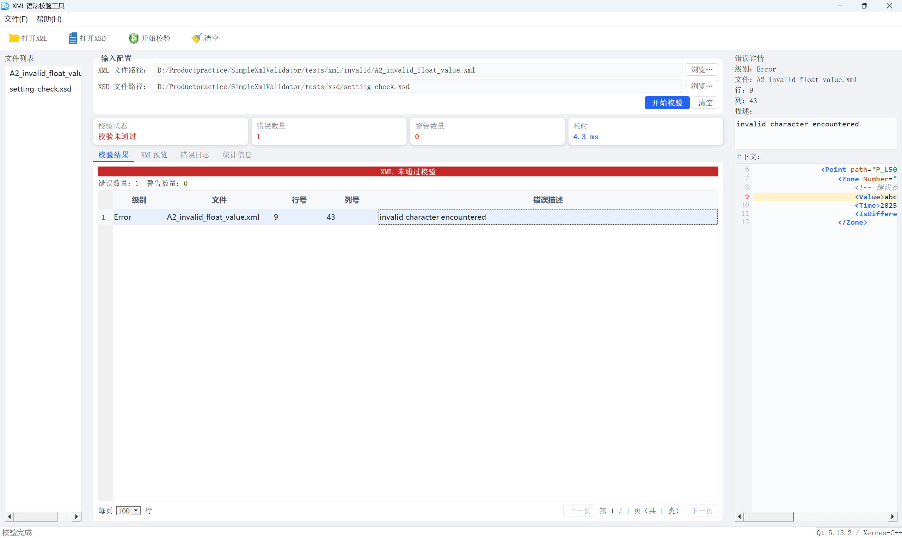
1.2.3 内部必需属性缺失 (A2_missing_ied_name.xml)
测试目的：验证嵌套层级中必填属性的缺失检查。
预期报错：(Error)missing required attribute 'name'
测试结果：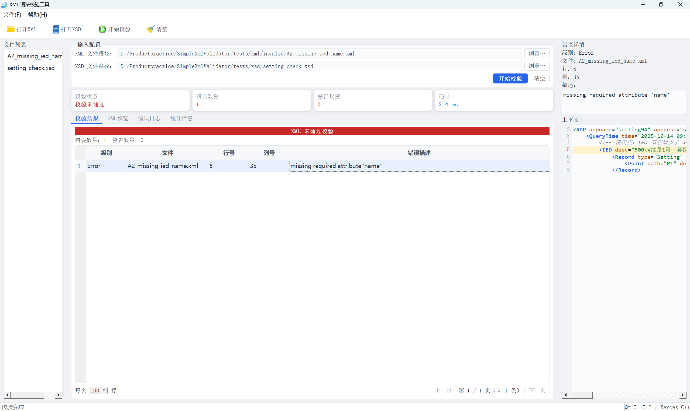

## 2 A3附录对应 XML 文件补充

2.1 补充格式良好性测试（Well-Formedness 致命错误）
2.1.1 综合性格式良好性错误 (A3_fatal_well_formedness.xml)
测试目的：验证标签未闭合、属性缺少引号、交叉嵌套等基础解析拦截。
预期报错：(Fatal)attribute value expected
测试结果：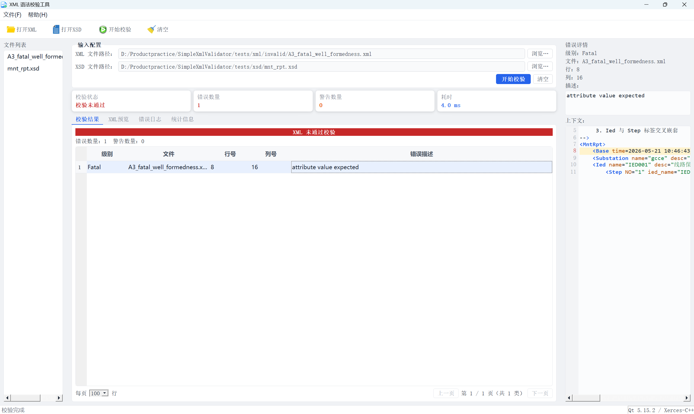
2.1.2 特殊字符未转义 (A3_fatal_special_char.xml)
测试目的：验证内容或属性中出现非法字符 < 和 & 时的报错。
预期报错：(Fatal)expected entity name for reference
测试结果：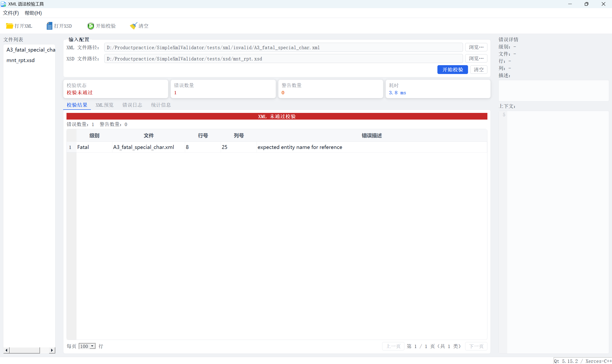

2.2 补充严密的 XSD 业务逻辑约束（Schema Error）
2.2.1 Base 节点 type 属性枚举值违规 (A3_invalid_base_type.xml)
测试目的：Base 的 type 在 XSD 中被严格定义为 mntBaseTypeType，仅允许"在线监视"或"模拟预演"。
预期报错：(Error)value '离线预演' not in enumeration
测试结果：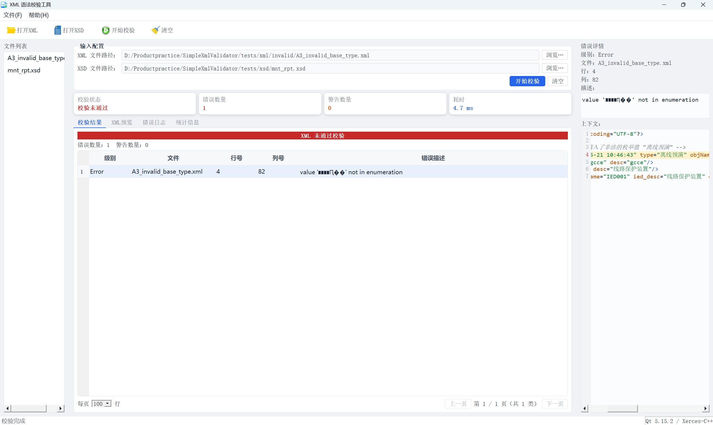
2.2.2 Step 节点 type 数值范围越界 (A3_invalid_step_type_range.xml)
测试目的：Step 的 type 在 XSD (mntStepTypeType) 中被限制为 minInclusive value="1" 和 maxInclusive value="10"。
预期报错：(Error)value '11' must be less than or equal to maxInclusive facet value '10'
测试结果：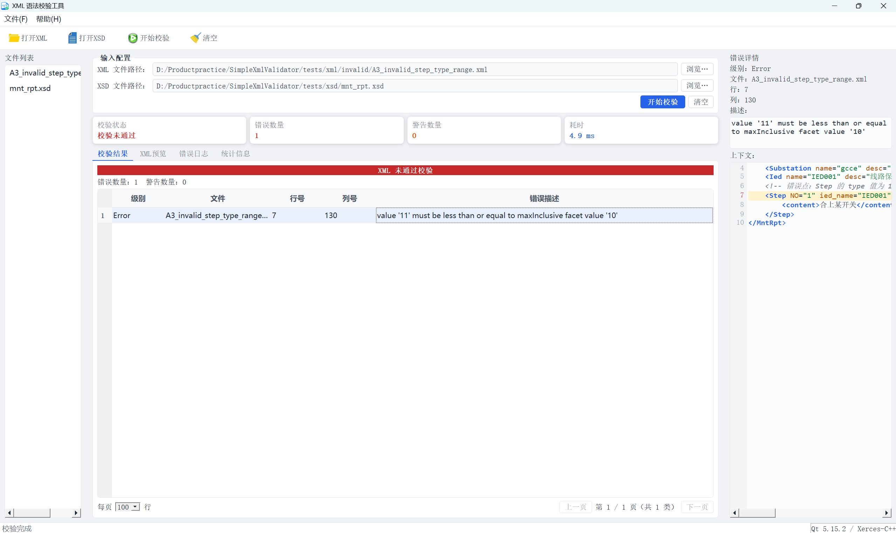
2.2.3 Step 节点 value 布尔类型违规 (A3_invalid_step_value.xml)
测试目的：验证 Step 的 value 属性是否遵循 bool01Type (仅限 0 或 1)。
预期报错：(Error)value '2' not in enumeration
测试结果：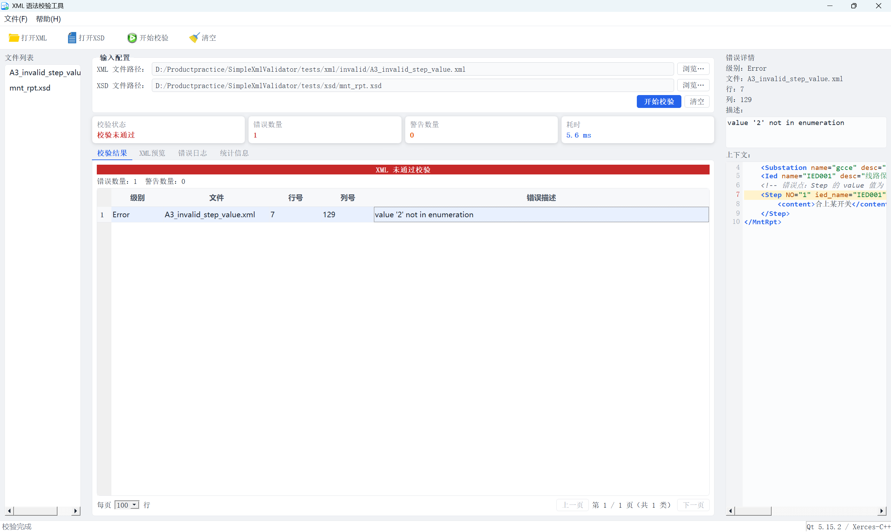
2.2.4 缺失必填子元素 Step (A3_missing_mandatory_step.xml)
测试目的：在 A.3 的 XSD 中，Step 节点是 minOccurs="1"，多重错误样例 测试了 content 缺失，但没有单独测试整个 Step 节点的缺失。
预期报错：(Error)missing elements in content model '(Base,Substation,Bay?,led+,Step+)'
测试结果：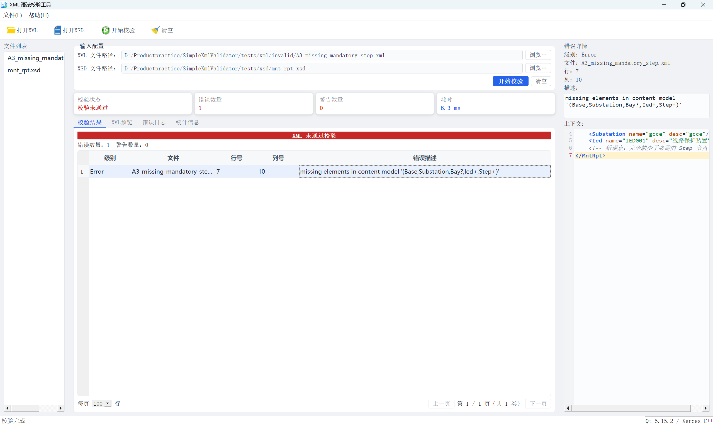
2.2.5 缺失必填属性 (A3_missing_required_attr.xml)
测试目的：验证内部元素在缺少 use="required" 属性时的拦截能力。
预期报错：(Error)missing required attribute 'desc'
         (Error)missing required attribute 'NO'
测试结果：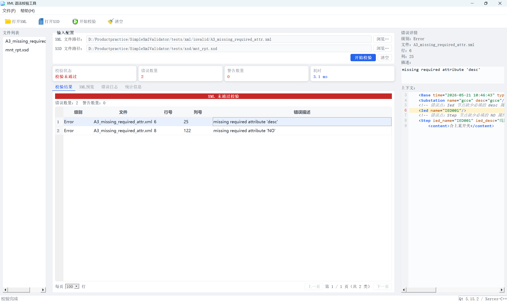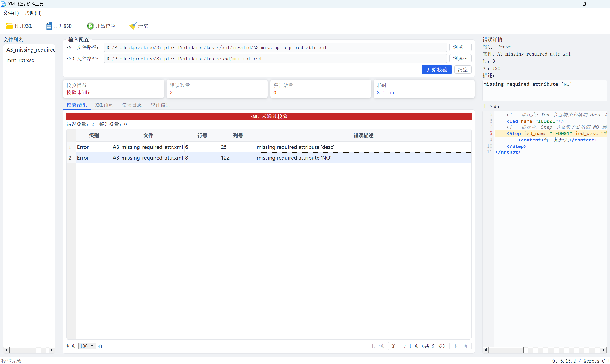

## 3 A4附录对应 XML 文件补充

3.1 补充格式良好性测试（Fatal Error 致命错误）
3.1.1 综合性格式良好性错误 (A4_fatal_well_formedness.xml)
测试目的：验证标签大小写不匹配、属性缺少引号等底层拦截。
预期报错：(Fatal)expected end of tag 'System'
测试结果：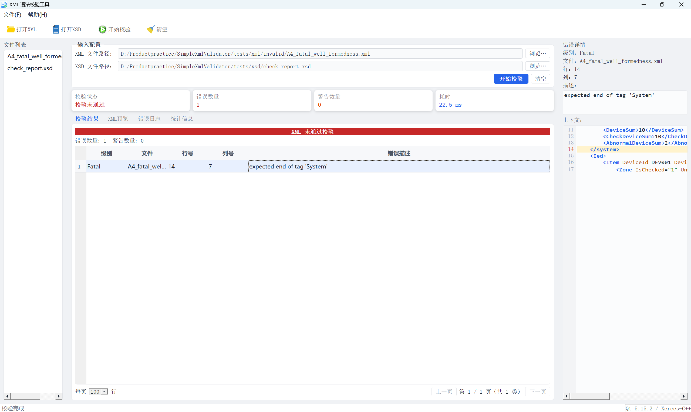
3.1.2 特殊字符未转义 (A4_fatal_special_char.xml)
测试目的：验证内容中出现非法保留字符时的报错。
预期报错：(Fatal)element name expected
测试结果：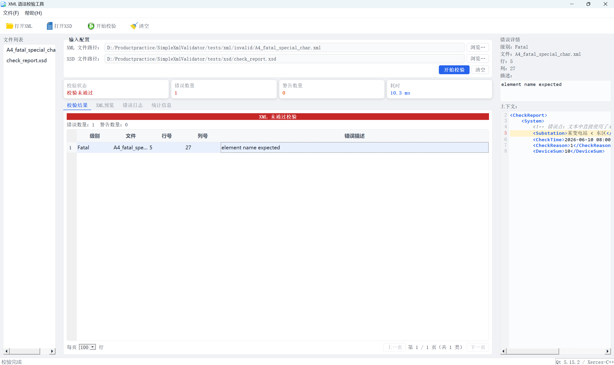

3.2 补充严密的 XSD 业务逻辑越界测试（Schema Error）
3.2.1 数值界限与枚举越界 (A4_invalid_numeric_bounds.xml)
测试目的：验证 DeviceSum (非负整数)、CheckReason (限制为1或2)、Result (限制为0至4) 的范围约束。
预期报错：(Error)value '3' not in enumeration
         (Error)value '-5' must be greater than or equal to minInclusive facet value '0'
         (Error)value '5' must be less than or equal to maxInclusive facet value '4'
测试结果：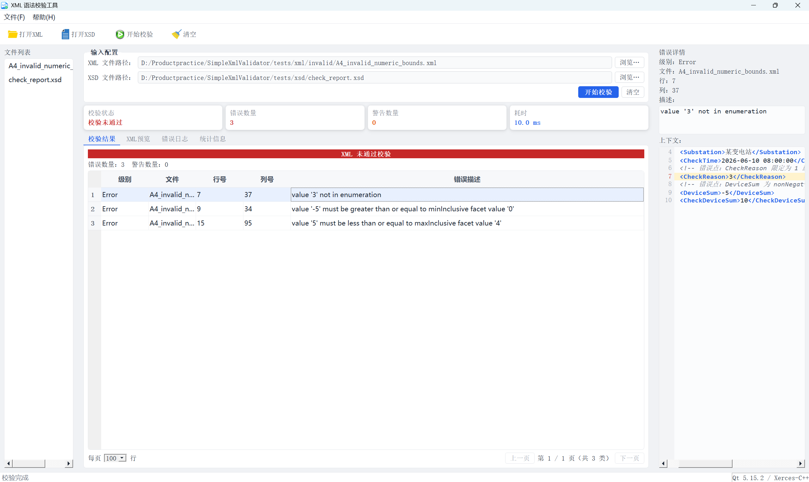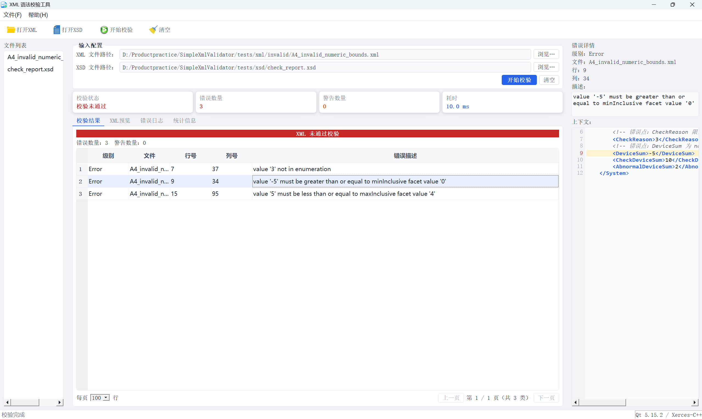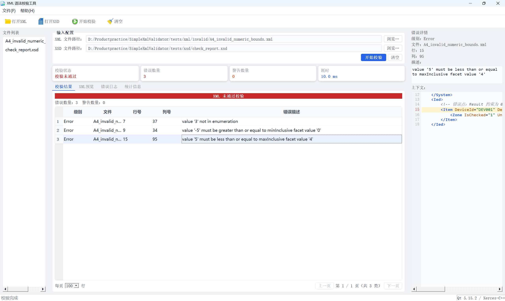
3.2.2 缺失 xs:choice 必填详细段 (A4_missing_choice_section.xml)
测试目的：在 check_report.xsd 中，<CheckReport> 根节点下规定必须包含至少一个详细巡视段 (<xs:choice minOccurs="1" maxOccurs="unbounded">)。
预期报错：(Error)missing elements in content model '(System,led,(DiffZone|...))'
测试结果：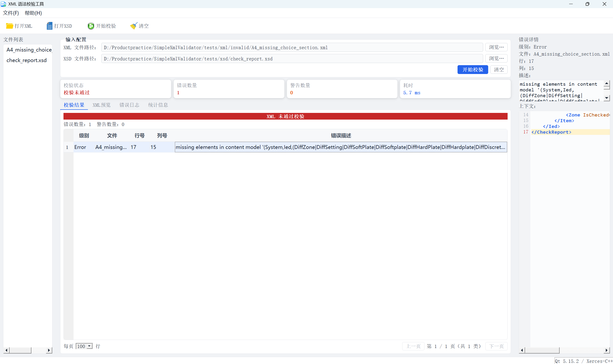
